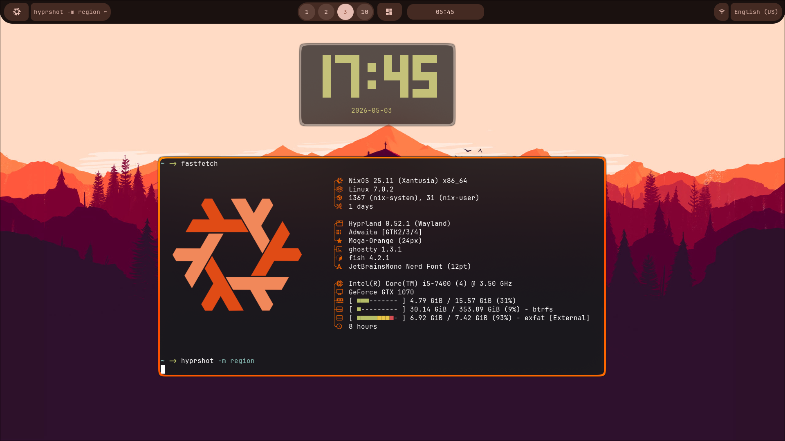
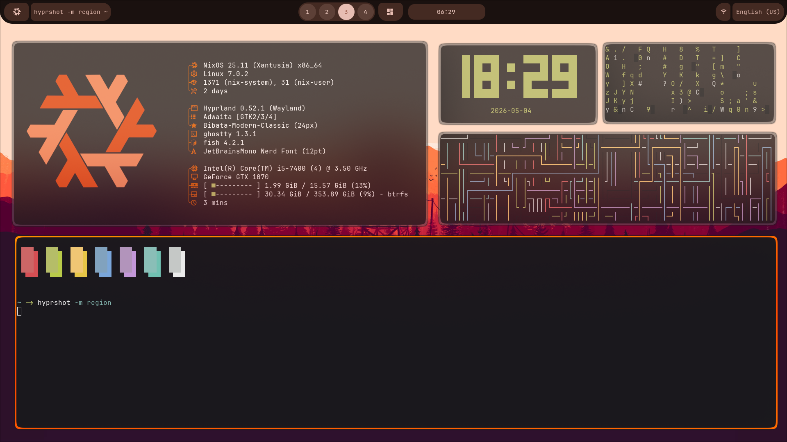

#  PrimeShell

PrimeShell — это конфигурация для Hyprland, ориентированная на эстетику в оранжевых тонах. Проект создан в процессе изучения кастомизации Hyprland, Niri и других оконных менеджеров.

> [!WARNING]
> Конфигурация находится в активной разработке!
> Если вы столкнулись с проблемой, пожалуйста, создайте **Issue**. Я постараюсь помочь, но не гарантирую решение всех технических сложностей.
> Ещё один важный момент: данная конфигурация на данный момент оптимизирована для работы именно с ПК имеющий данные характеристики:
> Видеокарта:  GTX 1070
> Процессор:   i5-7400
> Диск:        с BTRFS, примерно 350ГБ.

# Установка

Чтобы установить данную конфигурацию, вам необходимо выполнить данные действия:

Для NixOS:

1. Клонируем репозиторий:

```shell
git clone https://github.com/proprogrammistit8-ship-it/PrimeShell.git
```

2. Перемещаем папки и файлы из папки `.config` в свою локальную папку `.config`.

3. Запускаем бар:

Для NixOS:
```shell
# В папке склонированного репозитория
nix develop
python3 main.py
```

для Arch-based дистрибутивов для начала надо скачать сам [Fabric](https://github.com/Fabric-Development/fabric), а потом уже запускать командой
```shell
# Запускать находясь в ~/.config/primeshell(в папке primeshell из папки .config склонированного репозитория)
python3 main.py # Если есть Python, в большинстве дистрибутивов он поставляется по умолчанию.
# ИЛИ
python main.py
```


### 🛠 Известные проблемы
На данный момент скрипт автозапуска статус-бара может работать нестабильно. Для лучшего пользовательского опыта рекомендуется запускать бар вручную. Прошу прощения за временные неудобства — свободного времени сейчас немного. :<

## 📸 Скриншоты



## 🚀 Что реализовано сейчас
- **Статус-бар**: Полностью готов интерфейс, демонстрирующий финальный дизайн будущих обновлений.
- **Стек**: Написан на **Fabric** (Python-обёртка над GTK).
- **Окружение**: Оптимизировано под NixOS и проприетарные драйверы NVIDIA.

## 🗺 Дальнейшие планы
- [ ] Полный переход с Fabric на **iced_layershell** (Rust/Iced) для повышения производительности и стабильности.
- [ ] Фикс скрипта автозапуска бара.